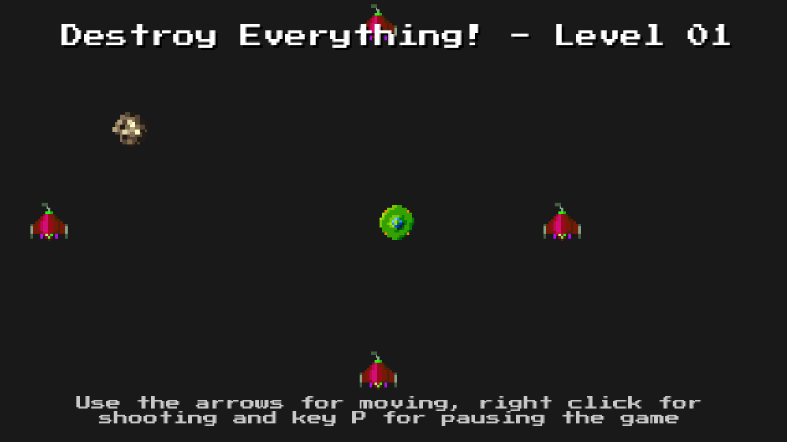

# Proyecto Talleres

Este proyecto es la version final de los ejercicios de taller, donde en la personalización se implemento el requerimiento 6: "Se esperan instrucciones de input muy simples en forma de texto en la pantalla". 

El proyecto está publicado en itch.io en el siguente link:  https://ichaparro.itch.io/destroy-it 